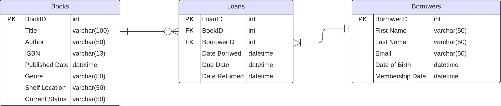

## Janas Fantastic Library Management System 📚

  This is a decent implementation of a real-world library database. (not so real) 🥰

  The entity relation diagram was designed using <a href = "https://www.lucidchart.com/pages/">Lucidchart</a>, 
  the database was built with <a href = "https://learn.microsoft.com/en-us/sql/ssms/download-sql-server-management-studio-ssms?view=sql-server-ver16">SQL Server Management Studio 20.2</a>,
  and the data was generated by <a href = "https://faker.readthedocs.io/en/master/">this interesting python library called Faker!</a>

 

  Down below you can find the ERD that illustrates all the entities, attributes, their data types together with the relationships and primary & foreign keys constraints. 

 

 

  As you can see, a book can exist in a library without getting borrowed ever, but a loan can't exist without a book, that explains the (1, ∞) relationship between <b>Books</b> and <b>Loans</b>, 
  Whereas a borrower can't exist without having at least one loan and at the same time a borrower can have multiple loans which explains the (1, ∞) relationship between <b>Loans</b> and <b>Borrowers</b>.

  You can find all the queries I wrote <a href = "Queries">here</a>, and all the functions, stored procedurs, and tables <a href = "dbo">here</a>.  

> **ps. I know I'm supposed to add the rationale behind everything I wrote in <a href = "README.md">here</a> but I'm too drained to do that right now, sorry, I might do it later tho, who knows 🤷‍♀️**

